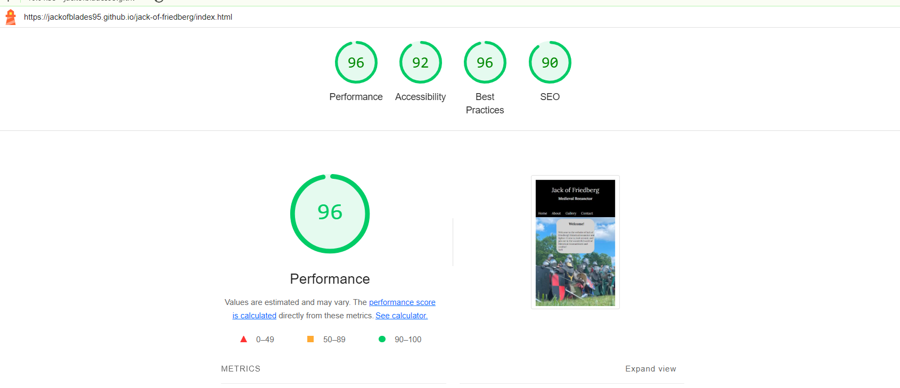

#  [Jack of Friedberg](https://jackofblades95.github.io/jack-of-friedberg/index.html)

* Jack of Friedberg is a simple website designed to advertise and showcase the experiences of a Medieval Reeanctor.
* Jack of Friedberg consists of a Home, About, Gallery and Contact pages.
* The website utilises a navbar to make it easy to naviagte the pages of the site.
* The site has social media links and a contact form to make it easy to get in contact with Jack of Friedberg.
* The site is targeted towards people who are interested in getting involved in medieval reeactment or looking to specifically
inquire or contact Jack of Friedberg for battles, tournaments, or for show fighting at events.

## Screenshots
Below are four screenshots of the different pages that make up Jack of Friedberg, created using the "Am I Responsive" website.

| Screenshot 1 |

| Screenshot 2 |

| Screenshot 3 |

| Screenshot 4 |

## User Stories

### First time Site Users

* As a new site user, I would like to know what the site is about.
* As a new site user, I would like to see pictures of medieval reenactment.
* As a new site user, I would like to know who Jack of Friedberg is and what he does.
* As a new site user, I would like to know how to get in contact with Jack of Friedberg, if im interested in reenactment or booking him for an event or show.
* As a new site user, I would like to the site to be easy to navigate.

## Wireframes

### Mobile Wireframes

### Tablet Wireframes

### Desktop Wireframes

## Design

### Color Scheme

* Colors used:

* #000000 for : header, footer, text.
* #FFFFFF for : social media icons, header text.
* #D3D3D3 for : background color.
* Colors were designed to match the colors of Jack of Friedberg during reeanctment.

### Typography

* I used the google font "Lora" for the website Jack of Friedberg. It is used all throughout the website.
* I felt it fit well with the theme of reenactment and medieval theme.
* Font Awesome Icons were used in the footer for social media links.
* [Google Font Lora](https://fonts.google.com/specimen/Lora)
* [Font Awesome Website](https://fontawesome.com/)

## Features

* Jack of Friedberg has an interactive navbar that hovers when cursor is placed over page title.
* Jack of Friedberg has a home page with a background photo and text welcoming the user to the site.
* Jack of Friedberg has an about page consisting of photo and text explaining who Jack of Friedberg is and what he does.
* Jack of Friedberg has a gallery page with photos showcasing events and battles of Jack of Friedberg and his group.
* Jack of Friedberg has a contact page with a form to contact Jack of Friedberg.
* Jack of Friedberg has social media links in the footer.

## Tools & Technologies Used

* [HTML](https://en.wikipedia.org/wiki/HTML)
* [CSS](https://en.wikipedia.org/wiki/CSS)
* [CSS Flex Box](https://www.w3schools.com/css/css3_flexbox.asp)
* [Google Fonts](https://fonts.google.com/)
* [Favicon](https://en.wikipedia.org/wiki/Favicon)
* [Github](https://github.com/)

## Testing

* Testing was conducted through HTML, CSS, validators and lighthouse.
* Below the links are screenshots.
* [W3C HTML](https://validator.w3.org/#validate_by_input)
* [W3C CSS](https://jigsaw.w3.org/css-validator/#validate_by_input)

### Testing Screenshots

| Index.html Test |

| About.html Test |

| Gallery.html Test |

| Contact.html Test |

| Lighthouse Test |

## Deployment

* Project was deployed as follows:

* Steps:

* Go to the Settings tab of your GitHub repo.

* On the left-hand sidebar, in the Code and automation section, select Pages.

* Make sure:

* Source is set to 'Deploy from Branch'.

* Main branch is selected.

* Folder is set to / (root).

* Under Branch, click Save.

* Go back to the Code tab. Wait a few minutes for the build to finish and refresh your repo.

* On the right-hand side, in the Environments section, click on 'github-pages'.

* Click View deployment to see the live site. The URL will look similar to YOUR-USERNAME.github.io/jack-of-friedberg.

## Credits

### Acknowledgements
